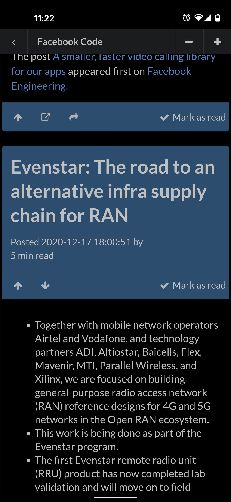

# YARR - Yet Another RSS Reader

## About

RSS reader for <a href="http://theoldreader.com/">The Old Reader</a>. 

When Google shut down their reader I had to find a new way to read my RSS feeds. After trying all services out there 
my pick was <a href="http://theoldreader.com/">The Old Reader</a>, probably because the service reminded me the most 
of the Google reader experience. 

However, what was lacking was a nice mobile user experience. So after a while I decided to implement my own. And 
here we are... Please try it out and tell me what you think!

Please report any feedback <a href="https://github.com/DanielSundberg/YARR/issues">in a Github issue</a>.

The actual Android container app is in another repository: <a href="https://github.com/DanielSundberg/YARR-Android">YARR-Android</a>.

## Technical implementation

Wanted to try out some "new" technologies and  create something useful. Among others I'm using the following libraries/technologies:

* Typescript
* React
* Mobx
* React-router 4
* Semantic-UI
* Create React App

Focus has been on creating a great mobile user experience.

## To get started

````
npm install
npm run start
````

Now point your browser to http://localhost:3000



