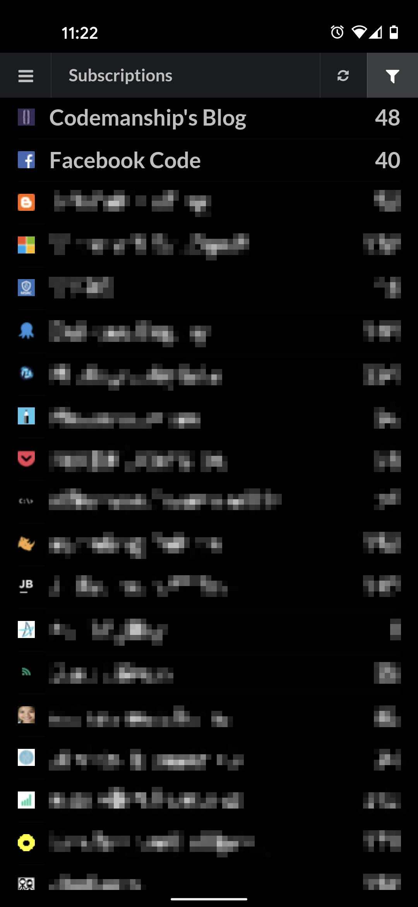

# AARR - Another Awesome RSS Reader

## Google Play Download

Please download the app from Google Play to support my development:
https://play.google.com/store/apps/details?id=com.danielsundberg.yarr


## New in version 2.0
* New color themes: Dark and Black.
* New icons.
* Fixed a few issues that caused a small horizontal scroll bar to appear in the blog reading view.
* Fixed a few cases of broken images and links.
* The blog rendering engine has been replaced in this release. Hopefully this will lead to a more stable and accurate rendering of blog content.


## About

RSS reader for <a href="http://theoldreader.com/">The Old Reader</a>. 

When Google shut down their reader I had to find a new way to read my RSS feeds. After trying all services out there 
my pick was <a href="http://theoldreader.com/">The Old Reader</a>, probably because the service reminded me the most 
of the Google reader experience. 

However, what was lacking was a nice mobile user experience. So after a while I decided to implement my own. And 
here we are... Please try it out and tell me what you think!

Please report any feedback <a href="https://github.com/DanielSundberg/AARR/issues">in a Github issue</a>.

The actual Android container app is in another repository: <a href="https://github.com/DanielSundberg/AARR-Android">YARR-Android</a>.

## Why the stupid name?
When I started this project I came up with the name YARR. Shortly after I started to work on this an 
new RSS reader called YARR appeared on Google Play. My Github project existed before this app was on 
Google play but unfortunately I did not have time to do a proper release. So to make it easy for me 
I changed the Y for an A. And had to come up with a new name that matched the new short name... 
And here we are.

## Technical implementation

Wanted to try out some "new" technologies and  create something useful. Among others I'm using the following libraries/technologies:

* Typescript
* React
* Mobx
* React-router 4
* Semantic-UI
* Create React App

Focus has been on creating a great mobile user experience.

## To get started

````
npm install
npm run start
````

Now point your browser to http://localhost:3000


## Screenshots




